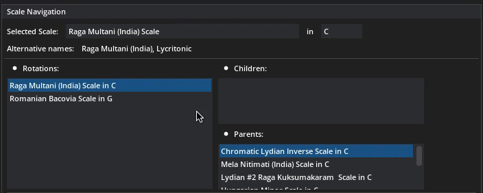

# COM418-2022-CMProject - Improvisation Guidance Tool

In the context of the Computers & Music (COM-418) course at EPFL, we implemented an Improvisation Guidance Tool. We analyse midi files to extract corresponding scales and suggest chords or notes to play along. 

We offer the following functionalities:
* Midi file selection 
* Midi player 
* Midi visualiser
* Personalisable scale suggestions
* Parametrisable chord & note suggestions

The repository contains the following elements: 
* [improvisation_guidance_tool.py](#improvisation-guidance-tool) : the GUI for our tool
* gui : contains utility files for the GUI 
* MIDI_Files : contains midi files with which to test (and play around with) the tool 
* music_tools : contains utility files for manipulating midi files and deriving musical information from the latter
* scale_researches : contains files relative to our research on scales
* TMP_Files : contains stored temporary files as a cache
* images : contains the wonderful images presented in this README

## Run Instructions
First you need to install all of the requirements using the following command:
```
pip install -r requirements.txt
```

Then you can launch the GUI :
```
python3 ./improvisation_guidance_tool.py 
```

## Improvisation Guidance Tool 
### Midi Player
To begin the user must select a midi file. This can either be done using the `File Selector` button or the `Random` button which selects a midi file at random from the `MIDI_Files` folder. 

The midi player allows user to play, pause or stop the midi. The user can also control the volume directly from the interface. 

### Midi Visualiser

The selected midi file will be displayed with notes along the x-axis. The y-axis can be displayed either in ticks, bartime or time (in seconds). The visualiser is colour-coded according to notes (independently of the octave). 


The user can also select which of the 12 midi file channels to display.

You can see an example of the visualisation for a midi of Eleanor Rigby by the Beatles below. 


### Scale Navigation
The Scale Navigation window allows users to select the scale for which they will receive chord suggestions. We have 170 scales to choose from in total. The user can select the tonic of the scale. We also show the rotations of this scale (i.e. other scales that have the exact same notes), children scales (whose notes are a subset of the selected scale) and parent scales (whose notes are a superset of the selected scale). 



#### Scale Suggestion
The scale suggestions are displayed under a table which shows the scale name, the accuracy of the suggestion, the amount of notes in the scale and alternate names for the scale if any. Suggestions can be tuned using the parameters explained hereafter. 

#### Parameters
The scale suggestion can be personalised under the following parameters:
* Normalize accuracy: TODO explain this
* Weighted by Beat Importance: idem
* Computation window (2 modes)
    * Bars: under this mode the suggestion will be computed over the displayed grey area on the visualiser. The user can choose the size of this window in bars. 
    * Entire window: under this mode the suggestion will be computed over the entire midi file. 
* Accuracy threshold: this threshold determines the accuracy with which the user would like the scales to be suggested (i.e. to filter out bad suggestions).
* Amount of notes: the user can select how many notes they would like the scale suggestions to have. 


#### Methodology

### Chord Suggestion


# References 
The midi files were collected from the following websites: 
* www.bitmidi.com
* www.midiworld.com
* www.feelyoursound.com
* www.mutopiaproject.org
* www.hooktheory.com

The GUI is based on the DearPyGUI library, for which we used the following ressources:
* https://dearpygui.readthedocs.io
* https://github.com/hoffstadt/DearPyGui/blob/master/DearPyGui/dearpygui/demo.py
* https://github.com/hoffstadt/DearPyGui/wiki/Dear-PyGui-Showcase#dearbagplayer

The scale and chord suggestions gained a lot from the following ressources:
* https://ianring.com/musictheory/scales/
* http://allthescales.org/index.php
* https://www.sciencedirect.com/science/article/abs/pii/S0020025518307163?via%3Dihub#fig0001

And finally the following ressources came in handy for playing around with midi files (notably the Mido and PrettyMidi libraries):
* https://mido.readthedocs.io
* https://www.twilio.com/blog/working-with-midi-data-in-python-using-mido
* https://craffel.github.io/pretty-midi/
* https://notebook.community/craffel/pretty-midi/Tutorial
