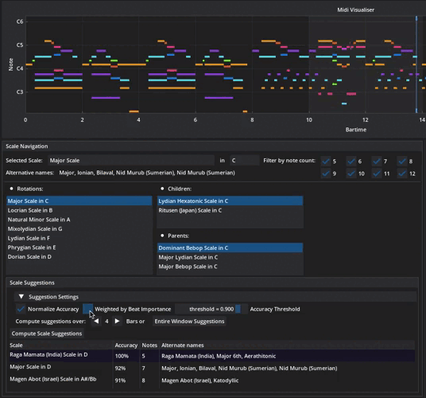
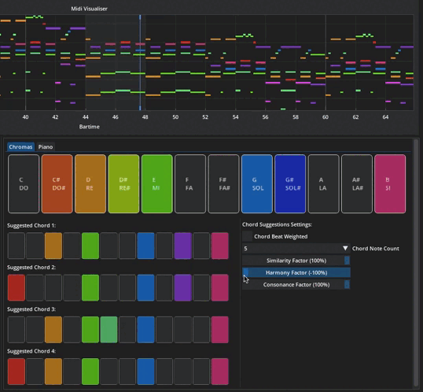
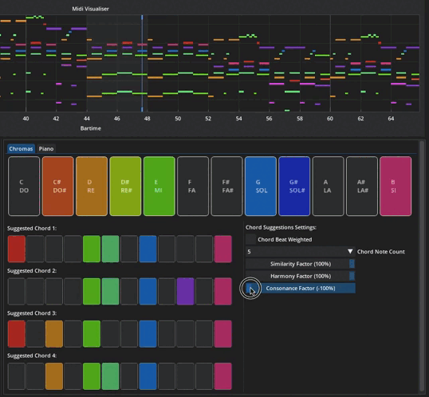

# Extemporaneous, an Improvisation Guidance Tool

In the context of the Computers & Music (COM-418) course at EPFL, we created Extemporaneous, an Improvisation Guidance Tool. We analyse midi files to extract corresponding scales and suggest chords or notes to play along. 

We offer the following functionalities:
* [Midi file selection](#midi-player) 
* [Midi player](#midi-player) 
* [Midi visualiser](#midi-visualiser)
* [Personalisable scale suggestions](#scale-navigation)
* [Parametrisable chord suggestions](#chord-suggestions)

The repository contains the following elements: 
* [improvisation_guidance_tool.py](#improvisation-guidance-tool) : the GUI for our tool
* gui : contains utility files for the GUI 
* MIDI_Files : contains midi files with which to test (and play around with) the tool 
* music_tools : contains utility files for manipulating midi files and deriving musical information from the latter
* scale_researches : contains files relative to our research on scales
* TMP_Files : contains stored temporary files as a cache
* images : contains the wonderful images presented in this README

## Run Instructions
First you need to install all of the requirements using the following command:
```
pip install -r requirements.txt
```

Then you can launch the GUI :
```
python3 ./improvisation_guidance_tool.py 
```

## Improvisation Guidance Tool 
### Midi Player
To begin the user must select a midi file. This can either be done using the `File Selector` button or the `Random` button which selects a midi file at random from the `MIDI_Files` folder. 


The midi player allows user to play, pause or stop the midi. The user can also control the volume directly from the interface. 


### Midi Visualiser

The selected midi file will be displayed with notes along the x-axis. The y-axis can be displayed either in ticks, bartime or time (in seconds). 


The visualiser is colour-coded according to notes (independently of the octave). 


The user can also select which of the 16 midi file channels to display (only non-empty channels are shown).


You can see an example of the visualisation for a midi of Eleanor Rigby by the Beatles below. 


The user can also make the display follow the cursor (i.e. the visualisation moves along with the music), as follows: 


### Scale Navigation
The Scale Navigation window allows users to select the scale for which they will receive chord suggestions. We have 170 scales to choose from in total. The user can select the tonic of the scale. Scales can be filtered by the amount of notes they contain. We also show the rotations of this scale (i.e. other scales that have the exact same notes), children scales (whose notes are a subset of the selected scale) and parent scales (whose notes are a superset of the selected scale). 


#### Scale Suggestion
The scale suggestions are displayed under a table which shows the scale name, the accuracy of the suggestion, the amount of notes in the scale and alternate names for the scale if any. Suggestions can be tuned using the parameters explained hereafter. 

#### Parameters
The scale suggestion can be personalised under the following parameters:
* Normalize accuracy: normalizes the accuracy of the scale suggestions (best becomes 100%, worst 0%).


* Weighted by Beat Importance: weight the suggestion by beat importance. For example in 4/4 time, the importance is as such: **ONE** two **three** four,  where the one has the highest importance, the three slightly less, and the two and four have about the same, lesser importance.



* Computation window (2 modes)
    * **Bars**: under this mode the suggestion will be computed over the displayed grey area on the visualiser. The user can choose the size of this window in bars. 
    * **Entire window**: under this mode the suggestion will be computed over the entire midi file. 


* Accuracy threshold: this threshold determines the accuracy with which the user would like the scales to be suggested (i.e. to filter out bad suggestions).


### Chord Suggestions

The chord suggestion tool suggests chords that are harmonious with the input MIDI file. The suggestions are highlighted in colour on the chromas and piano representations detailed below. 

### Parameters

The chord suggestions can be personalised by the user via the following parameters in the "Chord Suggestions Settings" window:
* Chord Beat Weighted: weight the suggestions by beat importance. 


* Note Count: the amount of notes in the chord.


* Similarity Factor: tune how similar the suggested chords will be to the midi window.


* Harmony Factor: a high harmonic factor will select chords that have notes which are musically similar (rather consonant intervals) to the most influent note (i.e. the note itself, major/minor third, dominant,...). 



* Consonance Factor: tune the consonance of the chords (the impression of stability and repose). This is determined by the spacing of the notes. Perfect consonances (unisons, octaves, perfect fourths and perfect fifths) will have a higher weight over imperfect consonances (major seconds, minor sevenths, major thirds, minor sixths, minor thirds and major sixths). 



Just like for the scale suggestions, the chord suggestions can be computed for a specific region of the MIDI file delimited by the cursor, or for the whole file. This parameter is the same for all suggestions, and is therefore modifiable via the [Scale Suggestion Settings](#parameters).

### Chromas

The first representation of the suggested chords is a simple chromatic scale from C to B. The main scale represents the overall suggested notes:


The secondary scales represent four suggested chords:


It uses the same colour scheme as the Midi Player.

### Piano

The suggested chords are also represented as piano tiles. As above, the main piano represents the overall suggested notes and the secondary pianos represent four suggested chords:
sugg


## Methodology 

Our methodology for the scale and chord suggestions can be found in the `technical_challenges.ipynb` notebook. 

# References 
The midi files were collected from the following websites: 
* www.bitmidi.com
* www.midiworld.com
* www.feelyoursound.com
* www.mutopiaproject.org
* www.hooktheory.com

The GUI is based on the DearPyGUI library, for which we used the following ressources:
* https://dearpygui.readthedocs.io
* https://github.com/hoffstadt/DearPyGui/

The scale and chord suggestions gained from the following ressources:
* https://ianring.com/musictheory/scales/
* http://allthescales.org/index.php
* https://music.stackexchange.com/

And finally the following ressources came in handy for playing around with midi files (notably the Mido and PrettyMidi libraries):
* https://mido.readthedocs.io
* https://www.twilio.com/blog/working-with-midi-data-in-python-using-mido
* https://craffel.github.io/pretty-midi/
* https://notebook.community/craffel/pretty-midi/Tutorial
* https://stackoverflow.com/
